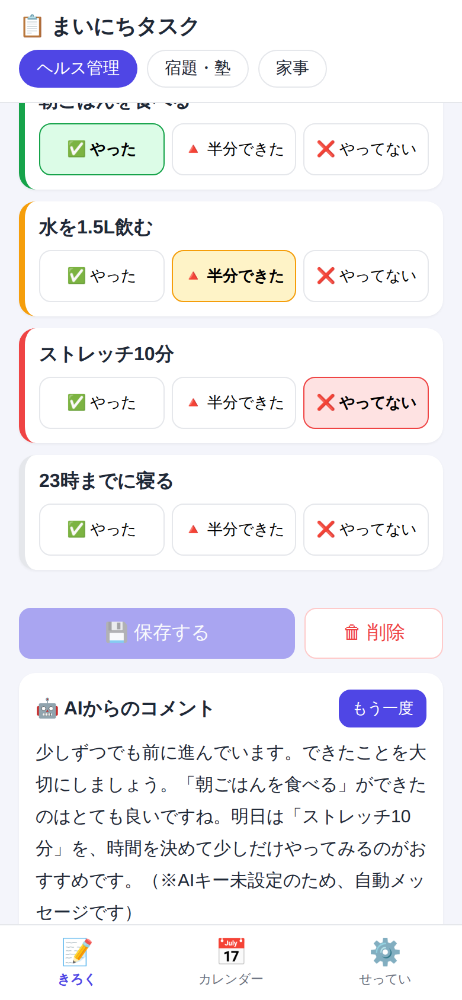
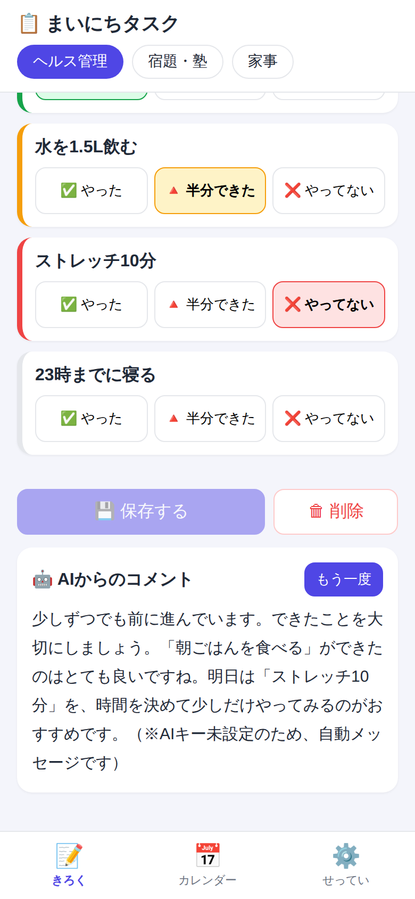
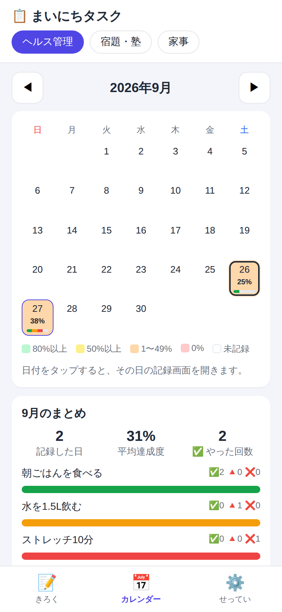
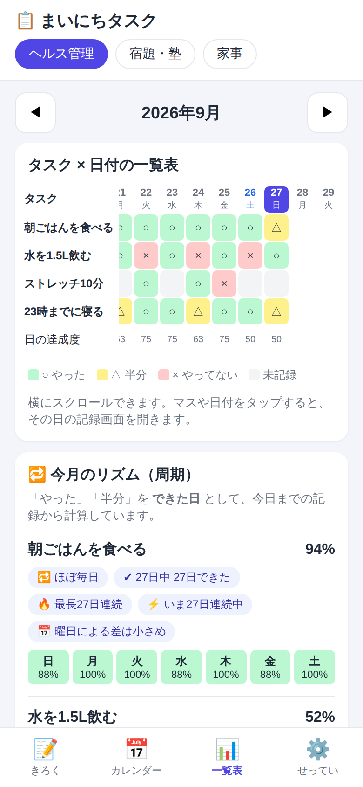
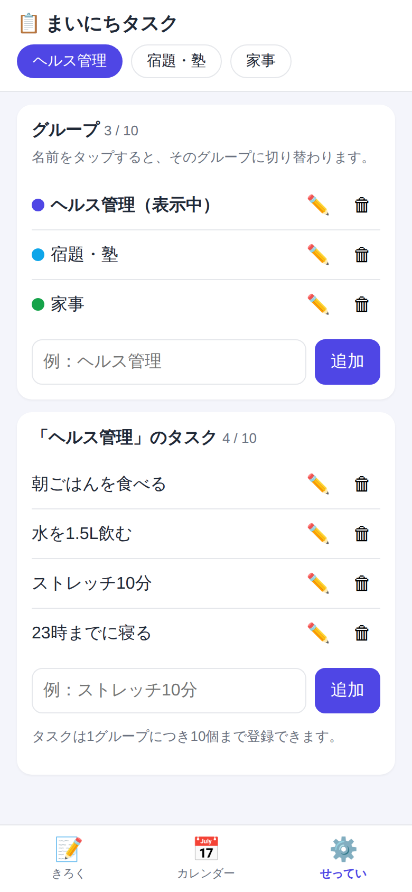

# 📋 まいにちタスク（GAS 日常タスク管理Webアプリ）

Google Apps Script（GAS）で作った、**スマホで使える日常タスク管理アプリ**です。
データはすべて Google スプレッドシートに保存されます。

| きろく | AIコメント | カレンダー | 一覧表 | せってい |
|:---:|:---:|:---:|:---:|:---:|
|  |  |  |  |  |

## できること（要件との対応）

| ご依頼の要件 | このアプリでの実現方法 |
|---|---|
| スプレッドシートにデータを残す | 「グループ」「タスク」「記録」「AIコメント」の4つのシートに自動保存 |
| タスクは10個以内、Webアプリ上で登録 | 「せってい」画面から追加。1グループ10個を超えると追加できない（画面とサーバーの両方でチェック） |
| タスク状況の登録・修正・削除 | 「きろく」画面で日付ごとに登録 → 保存。あとから修正・削除も可能 |
| 登録状況によりAIでコメント | 「コメントをもらう」ボタンで、その日＋直近7日の記録をAI（Gemini / OpenAI）が読んでコメント |
| カレンダーで日ごろの状況を確認 | 「カレンダー」画面で、達成度を色分け表示。月のまとめ・タスク別の集計も表示 |
| 各項目の一覧表・今月の周期（追加） | 「一覧表」画面で、タスク×日付の表と、タスクごとの周期（約◯日に1回）・連続日数・よくできる曜日を表示 |
| やった／半分できた／やっていない の3種類 | ✅ やった・🔺 半分できた・❌ やってない の3つのボタンで記録 |
| スマホレイアウト | スマホ幅に合わせた画面・下部メニュー・大きめのボタン |
| タスクのまとまりを複数作る | 「グループ」機能（例：ヘルス管理・宿題・塾・家事）。上部のタブで切り替え |
| 操作方法とコードの解説 | [操作マニュアル](docs/USER_GUIDE.md) ／ [コード解説](docs/CODE_GUIDE.md) |

## ファイル構成

```
gas-daily-task-app/
├── Code.gs          … サーバー側のプログラム（スプレッドシートの読み書き・AI呼び出し）
├── index.html       … 画面（HTML・デザイン・画面の動き）
├── appsscript.json  … GASの設定ファイル（タイムゾーンなど）
├── docs/
│   ├── USER_GUIDE.md … 操作マニュアル（使う人向け）
│   └── CODE_GUIDE.md … コード解説（しくみを知りたい人向け）
└── images/          … 説明用の画面イメージ
```

## セットアップ（約10分）

### 1. スプレッドシートとスクリプトを用意する

1. [Google スプレッドシート](https://sheets.google.com) で「空白のスプレッドシート」を新規作成し、名前を「まいにちタスク」などにします。
2. メニューの **拡張機能 → Apps Script** を開きます。
3. 最初からある `コード.gs` の中身をすべて消し、このフォルダの **`Code.gs` の中身を貼り付けて** 保存します。
4. 左の「ファイル」の **＋ → HTML** を押し、名前を **`index`** にします（`.html` は自動で付きます）。中身を消して **`index.html` の中身を貼り付けて** 保存します。
5. （任意）左の ⚙️「プロジェクトの設定」で「"appsscript.json" マニフェスト ファイルをエディタで表示する」にチェックを入れ、`appsscript.json` の中身を貼り付けると、タイムゾーンなどが設定済みになります。

### 2. 初期設定を実行する

1. エディタ上部の関数選択で **`setup`** を選び、▶ **実行** を押します。
2. 「承認が必要です」と出たら、自分のGoogleアカウントを選び「詳細」→「（安全ではないページ）に移動」→「許可」を押します。
   ※ 自分で作ったスクリプトなので問題ありません。
3. スプレッドシートに「グループ」「タスク」「記録」「AIコメント」のシートができ、サンプルのグループ（ヘルス管理・宿題・塾・家事）が入ります。

### 3. AIのAPIキーを設定する（任意）

AIコメントを使う場合は、どちらか1つのAPIキーを登録します。
**設定しなくてもアプリは動きます**（その場合はルールで作った自動メッセージが表示されます）。

1. Apps Script の ⚙️「プロジェクトの設定」→ 一番下の **スクリプト プロパティ** →「スクリプト プロパティを追加」
2. 次のどちらかを登録して保存します。

| プロパティ | 値 | 取得先 |
|---|---|---|
| `GEMINI_API_KEY` | Gemini の APIキー（おすすめ・無料枠あり） | [Google AI Studio](https://aistudio.google.com/apikey) |
| `OPENAI_API_KEY` | OpenAI の APIキー | [OpenAI Platform](https://platform.openai.com/api-keys) |

必要に応じて、使うモデルを `GEMINI_MODEL`（初期値 `gemini-2.5-flash`）や `OPENAI_MODEL`（初期値 `gpt-4o-mini`）で変更できます。

> ⚠️ APIキーはパスワードと同じです。コードの中に直接書かず、必ず「スクリプト プロパティ」に保存してください。

### 4. Webアプリとして公開する

1. 右上の **デプロイ → 新しいデプロイ** を押します。
2. ⚙️（種類の選択）→ **ウェブアプリ** を選びます。
3. 設定：
   - 次のユーザーとして実行：**自分**
   - アクセスできるユーザー：**自分のみ**（家族で使う場合は「Google アカウントを持つ全員」など）
4. **デプロイ** を押し、表示された **ウェブアプリのURL** をスマホで開きます。
5. スマホのブラウザで「ホーム画面に追加」をすると、アプリのように使えます。

> 💡 コードを修正したら「デプロイ → デプロイを管理 → ✏️ → バージョン：新しいバージョン → デプロイ」で反映されます（URLは変わりません）。

> ℹ️ データは1つのスプレッドシートに保存されるため、URLを共有した人とは**同じデータを見る・編集する**ことになります。家族それぞれで分けたい場合は、人数分スプレッドシートを作ってください。

## 使い方

➡ [操作マニュアル（docs/USER_GUIDE.md）](docs/USER_GUIDE.md)

## しくみ（コードの解説）

➡ [コード解説（docs/CODE_GUIDE.md）](docs/CODE_GUIDE.md)
